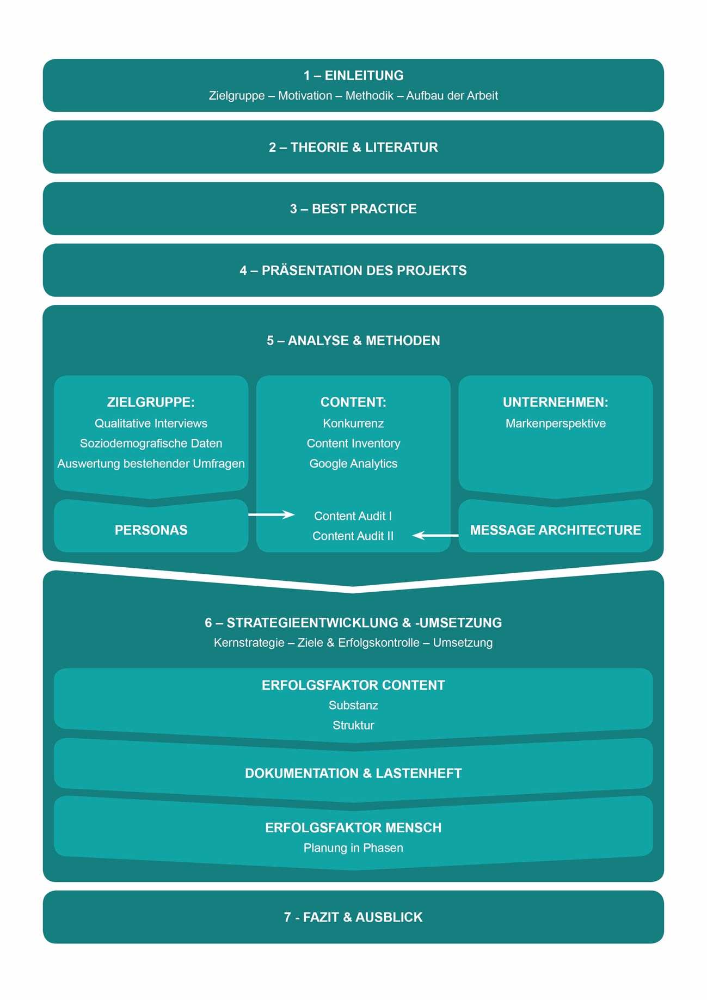
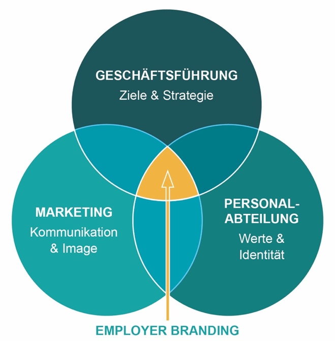
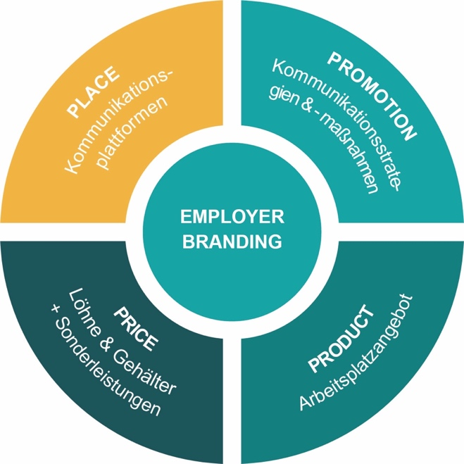
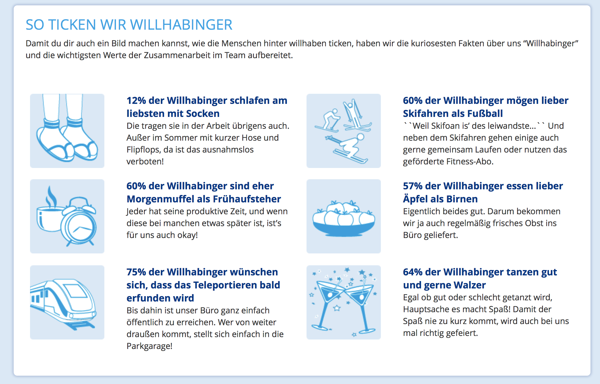
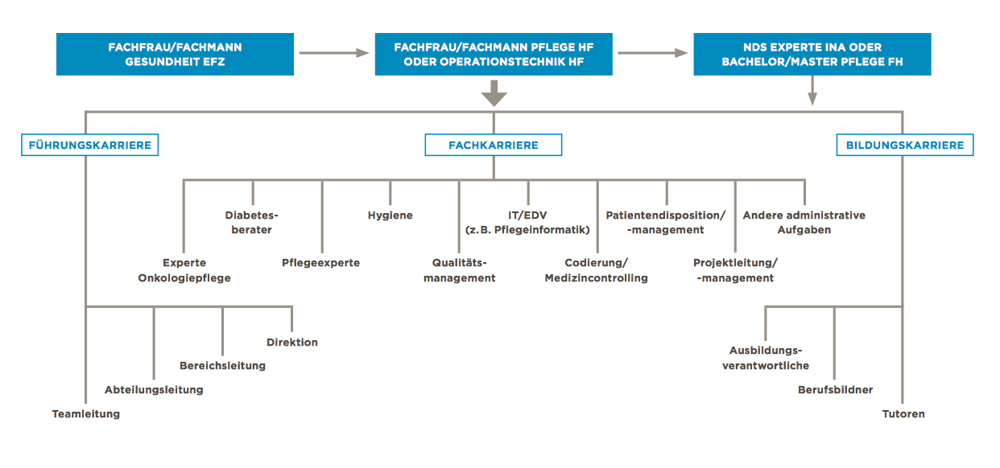

Methodik zur Gestaltung der Website als zentrales Element zur Steigerung der BewerberInnenzahlen am Beispiel der Tagesmütter Graz-Steiermark

**Masterarbeit**

am Studiengang

Content Strategie / Content Strategy

vorgelegt von

**Mag. Sabine Ettema**

Personenkennzeichen: 1510778003

am 26.6.2017

an der FH JOANNEUM

Erstbetreuerin: Dipl.-Medienberaterin Doris Eichmeier

Zweitbetreuer: Mag. Dr. Robert Gutounig

Kurzfassung {#kurzfassung .ListParagraph}
===========

Diese Arbeit beschäftigt sich mit der Erstellung einer Content Strategie im Umfeld von Employer Branding. Anhand eines Projektbeispiels für die Tagesmütter Graz-Steiermark zeigt die Autorin auf, welche methodischen Schritte aus Sicht der Content Strategie notwendig sind, um als Arbeitgeber für potenzielle BewerberInnen attraktiv zu sein. Eine wichtige Rolle spielt hier die Website, die im Zuge dieses Projekts neugestaltet werden soll. Diese Website soll künftig das zentrale Element der Kommunikation darstellen und in weiterer Folge die Basis für Content Marketing Aktivitäten bilden.

Zu Beginn der Arbeit zeigt die Autorin, in welchen theoretischen Kontext diese Arbeit eingebettet ist. Sie verdeutlicht anhand der „vier Ps“ des Marketing, in welchen Bereichen des Employer Branding Content Strategie wirken kann. Zudem geht sie im Literaturteil der Arbeit bereits auf Methoden ein, die im Praxisteil näher ausgeführt werden.

Im folgenden Kapitel veranschaulicht die Autorin anhand von Best Practice Beispielen, wie ausgewählte Arbeitgeber mit dem Thema der Personalsuche über die eigene Website umgehen. Sie wählt dabei bewusst auch andere Branchen als die des Auftraggebers. Dies soll dazu beitragen, neue Ideen für die Umsetzung zu bekommen.

In der Präsentation des Projekts werden Auftraggeber, Business Problem und Ziel näher erläutert. Ziel ist es, eine Website zu gestalten, die potenziellen BewerberInnen notwendige Informationen und Einblicke in den Berufsalltag als Tagesmutter gibt. Damit sollen Anzahl und Qualität der Bewerbungen erhöht werden. Da es das Kerngeschäft des Auftraggebers ist Tagesmütter zu vermitteln, sollte dieses Geschäftsfeld abgesichert bzw. ausgebaut werden. Um attraktiv für potenzielle Tagesmütter zu sein, braucht es eine fundierte Kenntnis dieser Zielgruppe. Hier bedient sich die Autorin qualitativer und quantitativer Analysen: Die gewonnenen Daten liefern die Basis für Personas, die als StellvertreterInnen der einzelnen Zielgruppen erstellt werden. Zudem analysiert die Autorin die bestehenden Webinhalte. Basierend auf einer quantitativen Erfassung der Inhalte wird das Ergebnis mittels zweier Content Audits verfeinert: Im ersten Content Audit gleicht die Autorin die Inhalte mit den Anforderungen der Personas ab, im zweiten Audit kommt die erarbeitete Markenperspektive zum Tragen.

Aufbauend auf die umfassende Methodik, wird die Content Strategie entwickelt und die Umsetzung geplant. Hier stützt sich die Autorin auf das Modell des Content Quads von Halvorson & Rach (2012) und erläutert die Rolle von Content und dem Faktor Mensch in der operativen Umsetzung. Außerdem geht sie auf die Rolle der Dokumentation ein, die einen kritischen Bestandteil von Projekten darstellt. Den Abschluss bildet die konkrete Planung der Umsetzung in drei Phasen, sowie ein Ausblick auf weitere empfohlene Maßnahmen.

**Keywords:** employer branding, content strategy, Content Strategie, userzentrierte Entwicklung

Abkürzungsverzeichnis {#abkürzungsverzeichnis .ListParagraph}
=====================

CI Corporate Identity

COS Content Strategie

EVP Employer Value Proposition

HR Human Resources (Personalwesen)

SEO Search Engine Optimization (Suchmaschinenoptimierung)

TM Tagesmutter

URL Uniform Resource Locator (Webadresse)

USP Unique Selling Proposition (Alleinstellungsmerkmal)

VPC Value Proposition Canvas

**Eidesstattliche Erklärung (nicht gesperrte Arbeit)**

Ich erkläre an Eides statt, dass ich die vorliegende Masterarbeit ohne fremde Hilfe verfasst, andere als die angegebenen Quellen und Hilfsmittel nicht benutzt bzw. die wörtlich oder sinngemäß übernommenen Stellen unter Angabe der Quelle als solche kenntlich gemacht habe. Der Durchführung einer elektronischen Plagiatsprüfung stimme ich hiermit zu.

Die vorliegende Originalarbeit ist in dieser Form zur Erreichung eines akademischen Grades noch keiner anderen Hochschule vorgelegt worden. Ferner gebe ich meine Einwilligung zur Veröffentlichung in der Universitätsbibliothek und online als Volltext.

Ich bin mir bewusst, dass eine falsche Erklärung rechtliche Folgen haben kann.

\[Unterschrift\] \[Ort,Datum\]

Methodik
--------

Diese Arbeit folgt im Wesentlichen der Methodik zur Erstellung und Implementierung einer Content Strategie nach Kristina Halvorson und Melissa Rach \[@halvorson2012\] sowie von Klaus Eck und Doris Eichmeier \[@eck2014\] und wird in der weiteren Arbeit näher erläutert.

Die Analysephase beinhaltet qualitative Interviews mit bestehenden Tagesmüttern, um einerseits deren Motivation für ihre tägliche Arbeit zu erheben, aber auch um Vorbehalte aus dem jeweiligen Umfeld zu erfragen. Zusätzlich werden sämtliche soziodemografische Daten bestehender MitarbeiterInnen analysiert, sowie eine bereits im Vorfeld durchgeführte AbsolventInnenbefragung und eine weitere MitarbeiterInnnenbefragung herangezogen. All diese Daten liefern die Basis für Personas, die als StellvertreterInnen der unterschiedlichen Zielgruppen erstellt werden.

Zur Erhebung der Websiteinhalte erstellt die Autorin ein sogenanntes „Content Inventory“. Dieses zeigt den mengenmäßigen Umfang des vorliegenden Projekts auf, sagt jedoch noch nichts darüber aus, ob diese identifizierten Inhalte auch für die Zielgruppen geeignet sind. Auf Basis der Personas werden diese quantitativen Websitedaten einer qualitativen Begutachtung unterzogen und um jene Informationen ergänzt, die im Zuge der Erstellung der Message Architecture erarbeitet werden (Card Sorting nach Margot Bloomstein). Ein weiteres Card Sorting wird im Anschluss zur Erarbeitung der Sitemap durchgeführt.

Die in weiterer Folge erstellten Guidelines für die Contenterstellung inkludieren neben den Markenwerten und den relevanten Informationen für die Zielgruppen auch Aspekte der Suchmaschinenoptimierung und Webkommunikation.

Aufbau der Arbeit
-----------------

Den Anfang der Arbeit bildet eine Übersicht über die Literatur und den theoretischen Hintergrund. Der Fokus der Literatur liegt hier in den Themenbereichen Content Strategie und Employer Branding. Daher liefert dieser Abschnitt Ansätze aus der aktuellen Fachliteratur zu diesen Themenbereichen. Diese sollen den LeserInnen aufzeigen, in welchen theoretischen Kontext das im Abschnitt vier beschriebene Praxisprojekt eingebettet ist.

Kapitel drei zeigt aktuelle Best Practice Beispiele im Bereich Employer Branding mit Fokus auf die Website auf. Diese kommen auch aus angrenzenden Branchen und Unternehmen anderer Größe.

Die Abschnitte vier bis sechs widmen sich ganz dem Praxisprojekt. Die Autorin beschreibt hier die Problemstellung des Unternehmens (4) ebenso wie die methodische Vorgehensweise, die Strategieentwicklung und die Implementierung derselben. Der Bereich der Implementierung stellt ein weiteres wichtiges Kapitel der Arbeit dar und liefert den LeserInnen die praktische Umsetzung der zuvor diskutierten Literatur und präsentierten Methodik.

Im abschließenden Fazit der Arbeit zeigt die Autorin auf, welche Erkenntnisse sie im Laufe des Projekts gewinnen konnte. Dieses Fazit soll den LeserInnen Informationen liefern, die für sie selbst bei der Umsetzung ähnlicher Projekte hilfreich sind.

{width="5.8553947944007in" height="7.891666666666667in"}

Abbildung 1: Aufbau der Arbeit (eigene Darstellung)

Literatur und theoretischer Hintergrund
---------------------------------------

Die vorliegende Arbeit beschäftigt sich in erster Linie mit der Erarbeitung einer umfassenden Content Strategie unter Anwendung vielfältiger in der Fachliteratur anerkannter Methoden. Diese Literaturquellen greift die Autorin erst in den betreffenden Kapiteln auf, da für sie das intensive Verflechten von Theorie und Praxis essentiell für den Erfolg ist. Außerdem soll damit den LeserInnen klarer verdeutlicht werden, welchen theoretischen Hintergrund die jeweilige Methodenwahl der Autorin hat.

Im Rahmen dieser Strategieerarbeitung beschäftigt sich die Autorin auch mit Teilbereichen des Employer Branding. Dieser Begriff ist im deutschsprachigen Raum auch als Arbeitgebermarke bekannt und tauchte in den 1990er Jahren zum ersten Mal in der Literatur auf \[@mattmuller2015\]. Die gesamte Entwicklung des Begriffes in den letzten 20 Jahren würde in dieser Arbeit zu weit führen. Wichtig ist aus Sicht der Autorin, dass Unternehmen durch das Schaffen einer Arbeitgebermarke eine weitere Zielgruppe neben ihren eigentlichen Kunden erkennen, nämlich die (potenziellen) ArbeitnehmerInnen.

Wie der Begriff schon vermuten lässt, wird privatdiese Disziplin auch in der aktuellen Literatur sowohl dem Bereich Human Resources als auch dem Marketing und der Kommunikation zugeordnet \[@hessegero2015\]. Zusätzlich spielt auch die Geschäftsführung eine wesentliche Rolle: Denn wird das Werteversprechen, das einem (künftigen) Mitarbeiter gemacht wird nicht von der Unternehmensführung gelebt, so bleibt es eine leere Floskel. Employer Brandig sieht sich also in der Schnittmenge von Geschäftsführung, Marketing und Human Resources.

{width="2.956541994750656in" height="2.995833333333333in"}

Abbildung 2: Employer Branding als Schnittmenge zwischen Geschäftsführung, Marketing und HR (eigene Darstellung)

Heute sehen sich durch geburtenschwache Jahrgänge und mangelnde Fachkräfte immer mehr UnternehmerInnen damit konfrontiert, geeignete ArbeitnehmerInnen in ihr Unternehmen zu bekommen und an sich zu binden. Im sogenannten “War of Talents” suchen sich gute Fachkräfte die Unternehmen, für die sie arbeiten möchten, aus und nicht umgekehrt. Vor allem die Generation Y oder auch Millennials – also jene Personen die in etwa zwischen 1981 und 1995 geboren sind – zeigen sich dabei sehr kritisch und selbstsicher \[@hessegero2015; @kunzel2013\]. Geld alleine ist oftmals nur noch ein geringer Anreiz. Selbstverwirklichung, eine ausgewogene Work-Life-Balance oder ein hohes Maß an Selbstbestimmtheit sind für diese Zielgruppe der ArbeitnehmerInnen heute wichtiger als noch für die Generationen davor \[@kurar2013\]

Mithilfe von Employer Branding schaffen und verankern Unternehmen also Arbeitgebermarken, die sich vom Mitbewerb abheben. “Ein gutes Employer Branding formuliert und vermittelt somit die positiven Aspekte eines Arbeitgebers, schafft eine Abgrenzung zu Konkurrenzunternehmen und spricht optimalerweise zielgruppenspezifische Bewerber genau wie bestehende Mitarbeiter an. Somit zahlt ein gutes Employer Branding immer auch auf die Themen Rekrutierung und Retention ein, indem es intern wie extern die Attraktivität des Unternehmens als Arbeitgeber akzentuiert”. \[@busch2013\]

Also gilt es, diese Arbeitgebermarke nach innen wie auch nach außen aufzubauen, umzusetzen und auch zu kommunizieren (Latzel, Dürig, Peters, & Weers, 2015, S. 20). Dabei ist es wichtig, dass das interne und externe Bild konsistent aber auch authentisch aufgebaut werden. Zudem sollte ein Unternehmen genau wissen, für welche BewerberInnen es attraktiv sein möchte um diese zielgerichtet erreichen zu können (Busch & Hartmann, 2013, S. 220).

Das interne Employer Branding zielt darauf ab, dass MitarbeiterInnen ihre/n ArbeitgeberIn als positiv wahrnehmen. Dies beinhaltet Entwicklungsmöglichkeiten im Job ebenso wie das Verhalten von Vorgesetzten, die interne Kommunikation oder die Gestaltung des Arbeitsplatzes. Diese interne Komponente des Employer Branding ist insofern wichtig, als Mitarbeiter somit langfristig an das Unternehmen gebunden werden können und andererseits als wichtige Markenbotschafter nach außen eingesetzt werden können (Latzel u. a., 2015, S. 20).

Vor allem der interne Bereich des Employer Branding umfasst Bereiche, Prozesse und Entscheidungen, die mit dieser Arbeit nicht abgedeckt werden können, da sie den Rahmen einer Content Strategie überschreiten. Eine Möglichkeit der Abgrenzung liefert hier Künzel (Künzel, 2013b, S. 60). Wie auch Hesse (2015) sieht er das Thema Employer Branding an der Schnittstelle zwischen Human Resources und Marketing. Künzels Verständnis von Marketing geht dabei über die reine Produktentwicklung oder das Pricing hinaus und orientiert sich sehr stark an Mc Carthy’s „vier Ps“ des Marketing, nämlich Product, Price, Place und Promotion (Kotler & Bliemel, Friedhelm, 2006, S. 150). Dass man in den letzten Jahren vor allem im Dienstleistungsmarketing zunehmend von „sieben Ps“ spricht, spielt nach Ansicht der Autorin für die nachfolgende Darstellung eine untergeordnete Rolle.

Künzel wendet also die „vier Ps“ des Marketing auf den Bereich der HR an. Ausgehend von “Product” münzt er die im Marketing bekannte Produktentwicklung auf den Personalbereich um. Ein Unternehmen sollte sich hier die Frage stellen, wie das “Produkt” ArbeitgeberIn auszusehen hat, um vom (potenziellen) Mitarbeiter positiv wahrgenommen zu werden. Die zweite Säule des Marketing betrifft die Preispolitik. Diese beschäftigt sich, bezogen auf HR, mit Löhnen, Gehältern oder verwandten Themen. In der Distributionspolitik (“Place”) sieht Künzel die Vertriebs- oder besser Kommunikationskanäle über die neue MitarbeiterInnen erreicht werden sollen. Das können Jobportale ebenso sein wie Social Media oder der eigene Webauftritt, um nur einige zu nennen. Im Bereich des letzten der „vier Ps“, der “Promotion”, ist die gesamte Kommunikationspolitik angesiedelt. Während Unternehmen gegenüber dem Kunden die sogenannte USP (Unique Selling Proposition), also das Alleinstellungsmerkmal kommunizieren, so ist es im Employer Branding die EVP, die Employer Value Proposition, die vermittelt werden soll. Sie bestimmt, wie über das Unternehmen kommuniziert wird, während die Distributionspolitik das “Wo” bestimmt (Künzel, 2013b, S. 56ff).

{width="2.988888888888889in" height="2.988888888888889in"}

[]{#_Toc486249155 .anchor}Abbildung 3: Die „vier Ps“ des Employer Branding, adaptiert nach Künzel (2013b)

Dieser grobe Überblick über das Projektbeispiel zeigt bereits, dass sich diese Arbeit damit beschäftigt, eine gesamte Content Strategie zu erstellen, die viele Facetten berücksichtigen soll. Die Basis für die Entwicklung dieser umfassenden Content Strategie legt die Literatur von Klaus Eck und Doris Eichmeier \[@eck2014\], von Kristina Halvorson und Melissa Rach \[@halvorson2012\] und jene von Margot Bloomstein \[@bloomstein2012\].

Willhaben.at
------------

Willhaben.at wurde 2017 bereits zum achten Mal in Folge als einer der besten Arbeitgeber Österreichs mit dem Siegel „Great Place to Work“ ausgezeichnet. Auf der für Bewerber eigens angelegten Subdomain <http://jobsbei.willhaben.at> finden sich zahlreiche Videos mit Einblicken in die Jobs verschiedenster Unternehmensbereiche. Die Videos sind sehr professionell gestaltet und vermitteln ein stimmiges Bild des Unternehmens. Da die Interviews vor Ort gedreht wurden, bekommen die BetrachterInnen beiläufig Einblicke in den Büroalltag. Verliehene Preise und positive bzw. motivierende Statements werden nebenbei und unaufdringlich eigeblendet. Insgesamt kommen neben der Geschäftsführerin auch um die 20 MitarbeiterInnen zu Wort, was wiederum vertrauenswürdiger wirkt als einzelne Ausgewählte.

In den Videobotschaften wird immer wieder die offene und auf Vertrauen basierte Unternehmenskultur angesprochen, sowie der gute Zusammenhalt im Team, der über die Arbeitszeit hinausgeht. Zusätzlich sind diese Videos auch in die Jobanzeigen des jeweiligen Unternehmensbereiches eingebettet (<http://jobsbei.willhaben.at>, 25.5.2017).

Außerdem finden sich sympathische „Fakten“ rund um die sogenannten „Willhabinger“, also jene Menschen, die für willhaben.at arbeiten:

{width="5.855155293088364in" height="3.7875in"}

[]{#_Toc486249156 .anchor}Abbildung 4: Statistik zum Schmunzeln bei willhaben.at \[@willhaben.at2017\]

Somit kommt willhaben.at mit sehr wenig geschriebenem Text aus und transportiert dennoch viel Sympathie und authentische Einblicke in das Arbeitsleben. Außerdem wird immer wieder erwähnt, dass willhaben.at weiterwachsen möchte und permanent geeignete Menschen sucht.

Die Bewerbung selbst kann sehr rasch über die Website erfolgen. Hier gibt es ein sehr einfaches Formular mit der Möglichkeit, eigene Dokumente hochzuladen und die Bewerbung abzuschicken. Positiv ist hier auch zu bewerten, dass bei jeder ausgeschriebenen Stelle Vor- und Zuname der Kontaktperson im Unternehmen stehen, an die man seine Unterlagen schickt.

Hirslanden Privatkliniken
-------------------------

Die Privatklinikgruppe Hirslanden betreibt 16 Kliniken in der Schweiz und ist mit seinen vielfältigen ambulanten wie auch stationären Angeboten das größte medizinische Netzwerk der Schweiz \[@privatklinikgruppe2015\].

Somit stehen auch hier Personalsuche und Weiterbildung an der Tagesordnung. Hirslanden wurde mit dem goldenen Best Recruiters Gütesiegel 2016/2017 ausgezeichnet \[@privatklinikgruppe2015\].

Auf untenstehendem Screenshot der Website möchte die Autorin einige interessante Punkte hervorheben. Der Hauptlesebereich in der Mitte des Bildschirms gliedert sich in drei Teile, die aus Sicht von BewerberInnen wesentlich erscheinen:

1.  Die Attraktivität des Arbeitgebers

2.  Aus- und Weiterbildungsmöglichkeiten

3.  Offene Stellen

{width="5.90625in" height="4.891666666666667in"}

Abbildung 5: Karriereseite bei Hirslanden \[@privatklinikgruppe2015\]

Im Menü rechts finden sich diese drei Punkte nochmals. Hinzu kommen hier Kontaktmöglichkeiten und Karrierepfade, auf die die Autorin weiter unten noch eingehen wird. Zudem werden Tweets eingeblendet. Diese stammen von einem Twitterkanal der eigens für Jobsuchende angelegt wurde und Follower laufend über neue Jobs informiert. Weiters ist Hirslanden auf Facebook sehr aktiv und zielt auch auf dieser Plattform vor allem auf künftige Mitarbeiter ab.

Wie auch willhaben.at hat Hirslanden eine Infografik mit einigen menschlichen Fakten zur Gruppe \[@privatklinikgruppe2015\]. Diese beinhaltet die Geschlechterverteilung ebenso wie die die Anzahl der MitarbeiterInnen, die gerade Nachwuchs bekommen haben, oder die Anzahl der Jahre, die der dienstälteste Mitarbeiter bereits im Unternehmen ist. All das sind Fakten, die auch vermitteln, dass sich Hirslanden mit den in der Organisation beschäftigten Menschen sehr bewusst auseinandersetzt.

Eine weitere interessante Unterseite beinhaltet das Thema Karrierepfade. Hier wird aufgezeigt, wie vielfältig die Aufstiegs- und Entwicklungsmöglichkeiten innerhalb der Organisation sind. Dabei wird zwischen Führungs-, Fach- und Bildungskarriere unterschieden. Außerdem bieten einige der Kliniken innerhalb der Gruppe die Möglichkeit, Diplomstudien verschiedener Fachrichtungen zu belegen.

Die Karrierepfade im Pflegebereich stellt Hirslanden wie folgt dar:

{width="5.985223097112861in" height="2.8046686351706036in"}

[]{#_Toc486249158 .anchor}Abbildung 6: Karrierewege bei Hirslanden (Privatklinikgruppe Hirslanden, o. J.)

Core Strategy Statement
-----------------------

Im Zentrum der weiteren Aktionen steht also die Kernstrategie. „*It defines how an organization (or project) will use content to achieve its objectives and meet its user needs*“ \[@privatklinikgruppe2015\]. Eine Möglichkeit dieses übergeordnete Ziel zu definieren, ist ein sogenanntes Core Strategy Statement. Dieses besteht im Wesentlichen aus vier Elementen, oder besser gesagt Fragen:

  Content Produkt                              Welchen Content sollen wir produzieren, beschaffen, kuratieren und teilen?
-------------------------------------------- ----------------------------------------------------------------------------
  Zielgruppen                                  Für wen ist dieser Content im Speziellen?
  Anforderungen an den Content aus Usersicht   Aus welchem Grund erwarten sich diese Zielgruppen Content von uns?
  Business Ziele                               Welche Ziele sollen mit diesem Content erreicht werden?

[]{#_Toc486246924 .anchor}Tabelle 4: Fragen für eine Core Content Strategy (Casey, 2015, S. 138)

Im vorliegenden Projekt für die Tagesmütter Steiermark könnte die Tabelle wie folgt aussehen:

  Content Produkt                              Informationen rund um den Job der Tagesmutter
-------------------------------------------- ----------------------------------------------------------------------------------------------------------------------------------
  Zielgruppen                                  Potentielle BewerberInnen (junge Mütter, QuereinsteigerInnen, PädagogInnen)
  Anforderungen an den Content aus Usersicht   Die Zielgruppen suchen nach einer Veränderung im Job, bzw. einer Möglichkeit mit Kindern wieder in den Berufsalltag einzusteigen
  Business Ziele                               Finanziell unabhängiger werden, mehr Einnahmen aus eigener Kraft generieren (abseits von Förderungen)

[]{#_Toc486246925 .anchor}Tabelle 5: Fragen für eine Core Strategy am Beispiel der Tagesmütter Steiermark

### Substanz

Content soll also dazu da sein, die gesetzten Ziele zu erreichen. In Hinblick auf die Steigerung der BewerberInnenzahlen und die Vorgabe, dass hier die Website neu gestaltet werden soll, stellen sich unter anderem folgende Fragen:

1.  Für wen soll Content im Speziellen produziert werden?

2.  Welche Themen sind für diese Zielgruppe(n) besonders interessant?

3.  Mit welchen Botschaften möchte das Unternehmen in Erinnerung bleiben?

4.  Wer liefert Content?

Für die Beantwortung der Frage, für wen Content produziert werden soll, leisten in der Praxis die bereits erstellten Personas gute Dienste. Sie können jederzeit bei Bedarf verwendet werden, um noch konkretere Ideen zu bekommen, welche Arten von Content für diese Personas Relevanz haben. Die Tabelle für das Content Audit stellt dafür eine gute Basis für die Weiterentwicklung dar. Hier hat die Autorin im Kapitel 5.5.2 bereits aufgezeigt, wo die Schwächen des aktuellen Contents aus Sicht der Personas liegen. Aus diesen Fragestellungen des Content Audits ergeben sich auch erste Themen, die für die Personas von Interesse sind:

-   Einblicke in das Berufsbild

-   Ein Tag im Leben einer Tagesmutter

-   Wie kann man mit dieser Berufswahl Job und Familie vereinen?

-   Was lerne ich in der Ausbildung?

-   Brauche ich als Kinderbetreuung überhaupt noch eine Ausbildung?

-   Einmal Tagesmutter, immer Tagesmutter? Kann ich in diesem Job Karriere machen?

-   Welche Unterstützung bekomme ich, wenn ich Probleme mit Kindern oder Eltern habe?

-   Was, wenn mir die Kreativität ausgeht?

-   Wie viel verdiene ich als Tagesmutter?

### References
